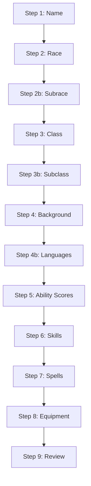

# D&D Character Sheet Enhancement Plan (v2.0)

## Current Architecture Analysis

The application uses:
- **API**: [dnd5eapi.co](https://www.dnd5eapi.co/api) for all D&D 5e data
- **7-Step Wizard**: Name → Race → Class → Background → Ability Scores → Starting Equipment → Review
- **Existing Homebrew System**: Built-in at line 1539 (`homebrew: {races:[],classes:[],spells:[],feats:[]}`)

---

## Part 1: Character Creation Wizard Enhancements

### 1. Race Variants/Subraces
**Problem**: User wants subrace options (e.g., Mountain Dwarf, Hill Dwarf)

**Solution**:
- The dnd5eapi.co provides subraces via `/races/{race-name}/subraces` endpoint
- Modify [`renderStep2()`](dnd-sheet.html:1662) to:
  1. Fetch race details when a race is selected
  2. Check for `subraces` array in the API response
  3. Display subrace selection when available

---

### 2. Subclass Selection (Level 1 Classes) - HIGH PRIORITY
**Problem**: Sorcerer, Paladin, Warlock, and Cleric get subclass options at level 1, but there's no UI for it.

**Current State**: 
- `state.wizard.subclass` and `subclassData` exist in the code
- But there's NO wizard step to select it!

**Solution**:
- Add new **Wizard Step 3.5** (between Class and Background) for subclass selection
- Fetch subclasses via API: `/classes/{class-name}/subclasses`
- Classes that need this at level 1: Sorcerer, Paladin, Warlock, Cleric

---

### 3. Background Options
**Problem**: User says only "Acolyte" appears

**Solution**:
- Verify API returns all backgrounds (Acolyte, Soldier, Sage, etc.)
- Ensure all results are displayed in the grid (check pagination)

---

### 4. Ability Score Rolling - HIGH PRIORITY
**Problem**: No rolling option exists - only Standard Array, Point Buy, Manual Entry

**Solution**:
- Modify [`renderStep5()`](dnd-sheet.html:1781) to add "Roll" button
- Implement 4d6 drop lowest rolling method
- Add reroll button and ability to lock individual scores

---

### 5. Starting Equipment Enhancement
**Problem**: User wants more equipment options

**Solution**:
- Ensure all API equipment choices are displayed
- Add manual equipment addition option

---

### 6. Skill Selection (NEW)
**Problem**: Some classes/races get extra skill proficiencies at level 1

**Solution**:
- Add new wizard step after subclass for skill selection
- Fetch available skills from character data
- Display skill selection grid with proper count

---

### 7. Spell Selection (NEW)
**Problem**: Spellcasting classes need to select spells at level 1

**Solution**:
- Add new wizard step for spell selection
- Fetch spell list from API: `/classes/{class}/spells`
- Allow selectingcantrips and 1st-level spells based on class

---

### 8. Language Selection (NEW)
**Problem**: Some races/backgrounds grant extra languages

**Solution**:
- Add language selection after background or in identity section
- Fetch available languages from API

---

## Part 2: Rulebook/Homebrew System Integration

### The Challenge
- **dnd5eapi.co** only contains SRD (Basic Rules) content
- **Tasha's Cauldron, Xanathar's, and all other sourcebooks are NOT available via this API**

### Solution: Local Data Overlay System

We will create a local data system that supplements the API:

#### Data Structure
```
/data/
  ├── tashas-cauldron.json      # Tasha's Cauldron of Everything
  ├── xanathars.json            # Xanathar's Guide to Everything
  ├── motm.json                 # Monsters of the Multiverse
  ├── fizban.json               # Fizban's Treasury of Dragons
  ├── glory-giants.json         # Bigby Presents: Glory of the Giants
  ├── book-many-things.json     # The Book of Many Things
  ├── scag.json                 # Sword Coast Adventurer's Guide
  ├── ravenloft.json            # Van Richten's Guide to Ravenloft
  ├── ravnica.json              # Guildmasters' Guide to Ravnica
  ├── acquisitions.json         # Acquisitions Incorporated
  ├── volos.json                # Volo's Guide to Monsters
  ├── mtofs.json                # Mordenkainen's Tome of Foes
  └── index.json                # Master index of all content
```

#### Rulebook Contents to Implement

| Sourcebook | Content Types | Priority |
|------------|--------------|----------|
| **Tasha's Cauldron of Everything** | Subclasses, Feats, Custom Origins, Spells, Rules | HIGH |
| **Xanathar's Guide to Everything** | Subclasses, Spells, downtime activities, DM tools | HIGH |
| **Monsters of the Multiverse** | New Races, Updated Monsters | HIGH |
| **Fizban's Treasury of Dragons** | Dragon-related content, new races | MEDIUM |
| **Glory of the Giants** | Giant-themed content | MEDIUM |
| **The Book of Many Things** | Magic items,Oracle system | LOW |
| **Sword Coast Adventurer's Guide** | Additional classes, spells, backgrounds | MEDIUM |
| **Van Richten's Guide to Ravenloft** | Dark-themed races, monsters | LOW |
| **Guildmasters' Guide to Ravnica** | Setting-specific content | LOW |
| **Acquisitions Incorporated** | Business/humor content | LOW |
| **Volo's Guide to Monsters** | Additional races, monsters | MEDIUM |
| **Mordenkainen's Tome of Foes** | Deep lore, additional monsters | LOW |

#### Implementation Strategy

1. **Phase 1: Data File Creation**
   - Create JSON schema for each content type
   - Populate with key data from each sourcebook

2. **Phase 2: API Enhancement**
   - Modify `apiGet()` to check local files first
   - Merge local data with API responses
   - Add sourcebook toggle in settings

3. **Phase 3: UI Updates**
   - Add rulebook selection in character wizard
   - Filter content by selected sourcebooks
   - Show sourcebook badges on content

---

## Mermaid: Enhanced Wizard Flow



---

## Implementation Priority

| Priority | Feature | Notes |
|----------|---------|-------|
| 1 | Add subclass selection wizard step | Most impactful - classes depend on this |
| 2 | Add ability score rolling | High player demand |
| 3 | Fix/verify background display | Quick fix |
| 4 | Add race subrace support | API-driven |
| 5 | Skill selection step | Requires mapping proficiencies |
| 6 | Spell selection step | Complex - depends on class |
| 7 | Language selection | Quick addition |
| 8 | Starting equipment enhancement | Low priority |
| 9 | Local rulebook data files | Long-term project |
| 10 | Rulebook toggle UI | Depends on data files |

---

## Technical Notes

### API Endpoints to Use
- `/races` - List of races
- `/races/{index}/subraces` - Subraces for a race
- `/classes` - List of classes
- `/classes/{index}/subclasses` - Subclasses for a class
- `/classes/{index}/spells` - Spells available to class
- `/backgrounds` - List of backgrounds
- `/skills` - List of skills
- `/languages` - List of languages
- `/equipment` - Equipment list

### Data Merge Strategy
```javascript
async function enhancedApiGet(path) {
  // 1. Check local data first
  const local = await checkLocalData(path);
  if (local) return local;
  
  // 2. Fall back to API
  return await apiGet(path);
}
```

---

## Next Steps

1. **User Approval**: Confirm this enhanced plan
2. **Implementation Start**: Switch to Code mode
3. **Immediate**: Subclass selection + Ability rolling
4. **Short-term**: Skill/spell/language selection
5. **Long-term**: Rulebook data files

---

*Plan v2.0 - Updated with skill/spell/language selection and comprehensive rulebook integration*
